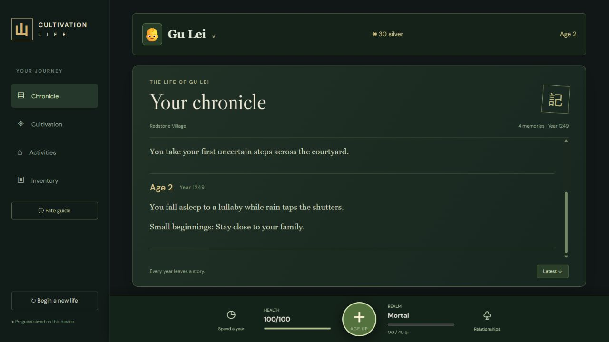
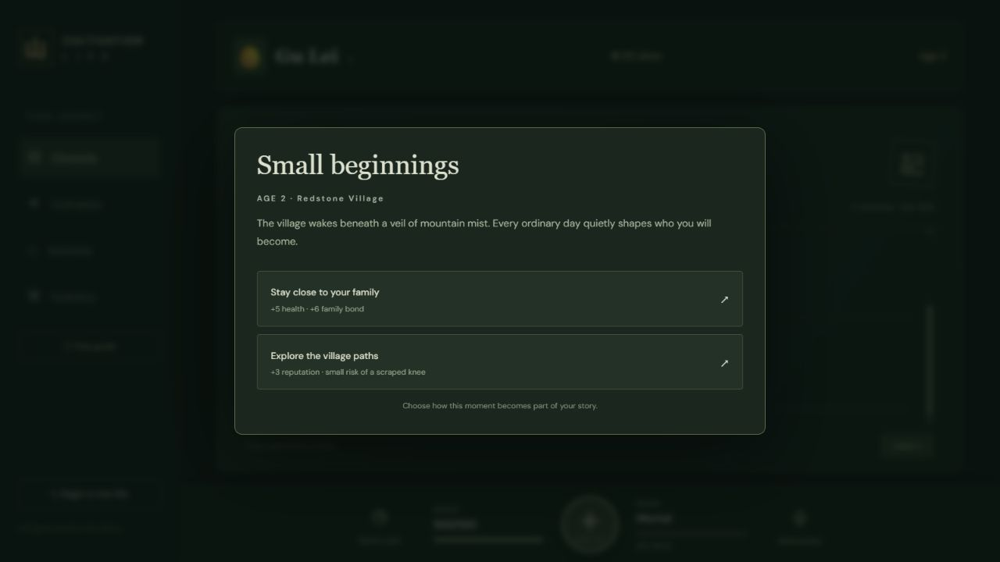
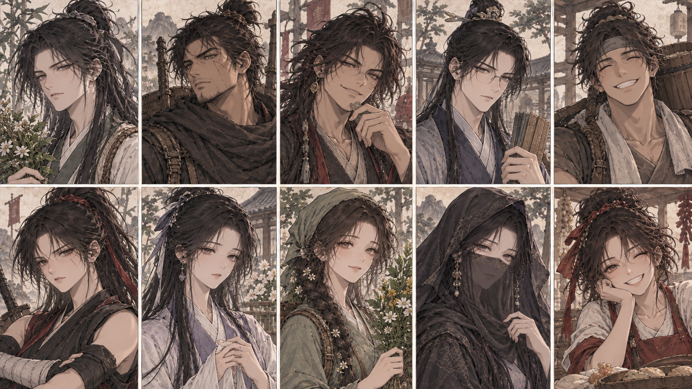

<div align="center">

# 山 Cultivation Life

**One lifetime. Countless choices. A path toward immortality.**

A text-based Murim life simulator inspired by the year-by-year storytelling of BitLife and the progression of cultivation games.

**React · TypeScript · Vite | Playable prototype**

[How to play](#how-to-play) · [Run locally](#run-locally) · [Game design](GAME_CONCEPT.md)

</div>



## Your life, written one year at a time

Begin as a newborn in a randomly chosen village and family. Grow up, attend martial school, form friendships, earn a living, and gather qi as you pursue higher realms. Your decisions and the quiet moments between them become a chronicle of the life you lived.

Cultivation Life is an evolving playable prototype. The systems below are available now; the broader world and deeper progression are still being developed.

## Inside the game

| Feature | What you can do |
| --- | --- |
| **Create your character** | Choose your name, gender, and child and adult portraits. Reroll your village, family, spiritual element, talent, personality, and attributes. |
| **Follow your chronicle** | Read a scrollable journal grouped by age, with birth details, everyday memories, milestones, and the consequences of your choices. |
| **Attend martial school** | Enroll at six, complete assignments, train, and meet students and teachers. School grants qi each year and can trigger supervised breakthroughs. |
| **Cultivate** | Gather qi, watch your progress, compare bonuses, and attempt breakthroughs. Idle cultivation opens at twelve. |
| **Meet people** | Open NPC profiles to inspect portraits, backgrounds, personalities, stats, and available interactions. Build friendships or create rivalries. |
| **Explore activities** | Visit the market and alleys, train, seek a master, and pursue clan connections or royal favor. |
| **Build a livelihood** | After graduation, apply for jobs based on your credentials. Receive your salary when you age up. |
| **Manage your belongings** | Buy consumables and cultivation equipment, use items, and equip a bonus item through Inventory. |

## Moments that shape your story



Events appear as choices at important or unexpected moments, with quiet years in between. Resolve an open event before continuing your life. Background memories keep the chronicle moving even when no popup appears.

## Faces of the martial world



NPCs have persistent identities, portraits, ages, jobs, traits, backgrounds, and relationship histories. The portrait pools include children and adults, with male portraits in the upper row and female portraits in the lower row. Your chosen adult appearance appears at eighteen.

## How to play

### 1. Begin your life

Choose a name and gender, then select child and adult portraits. Use **Roll your fate again** to try a different starting background. Open **All results & details** to understand the available rolls, including ones you did not receive. Select **Begin life** when ready.

### 2. Make each year count

Use your **three activity points per year** for available actions. Open **Spend a year** on the bottom left to choose your annual focus, then press the large **+ Age Up** button to advance one year. Activities and their requirements change as you grow.

Read the Chronicle for outcomes. Only the journal scrolls, while the character header and bottom controls stay within reach.

### 3. Learn at school

At **age 6**, a welcome popup introduces martial school. Open **School** to work on assignments, train, and view classmates or teachers. Click a person's name to open their profile and choose an interaction. Yearly schooling naturally grants qi and can help you break through.

### 4. Develop your cultivation

At **age 12**, use the Cultivation screen to manage idle gathering and inspect your qi progress and bonuses. A living master, certain personality traits, clan membership, and equipped items can improve cultivation speed. Offline accumulation is capped at four hours.

Click your **name or portrait in the top bar** to open your character menu. **Inner Path** contains the manual breakthrough action. Check its requirements and success chance before attempting it; sufficient qi alone does not guarantee success.

**Current realms:** Mortal → Qi Gathering → Foundation Establishment → Core Formation → Nascent Soul.

### 5. Build relationships and an adult life

The bottom-right **Relationships** button separates parents from friends. New acquaintances enter the friends list after you successfully befriend them. Open their profiles to talk, train, and use other available actions.

At **18**, graduation replaces School with **Occupation**. Browse jobs, check their qualifications, and apply. Employment pays once per aged year, so balance your ambitions with your health, relationships, and cultivation.

### Useful things to know

- Keep an eye on **health**, **silver**, and the **realm / qi bar** beside Age Up.
- Read action costs and event effects before making a choice.
- Elemental affinities currently describe your character; elemental techniques are planned.
- Progress saves automatically in **localStorage**, with one life per browser and site address. Saves do not sync between devices or between localhost and a hosted game.
- **Begin a new life** replaces the current save after confirmation.

## Run locally

Use Node.js **22.6 or newer** and npm.

```sh
git clone https://github.com/ZegionV2/cultivation-life.git
cd cultivation-life
npm install
npm run dev
```

Open the local URL printed by Vite.

| Command | Purpose |
| --- | --- |
| `npm run dev` | Start the development server |
| `npm test` | Run game mechanics tests |
| `npm run build` | Type-check and create the production build |
| `npm run preview` | Preview the production build locally |

## Deploy to Vercel

Import this repository into Vercel and use these project settings:

| Setting | Value |
| --- | --- |
| Framework preset | Vite |
| Build command | `npm run build` |
| Output directory | `dist` |
| Environment variables | None required |

## What's next

Future work includes deeper martial techniques and combat, travel, richer clan politics, expanded NPC life stories, and persistent legacy systems. These are planned features, not promises of functionality in the current prototype.

See [GAME_CONCEPT.md](GAME_CONCEPT.md) for the implemented design and roadmap, or [the original concept](docs/ORIGINAL_GAME_CONCEPT.md) for the early vision.

---

Portrait artwork is supplied as project assets. This repository does not grant a general redistribution license for the artwork.
